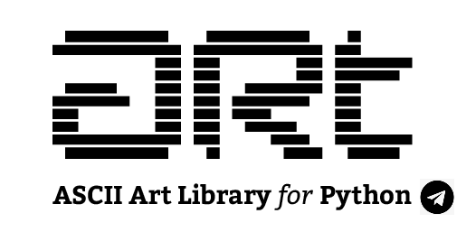
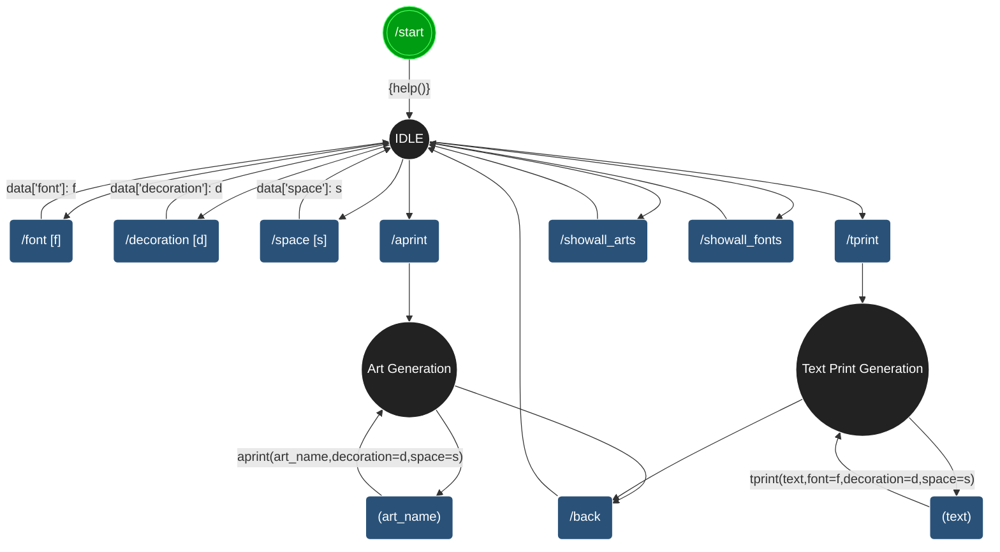

    </img>
    <h1>ASC11AR7 (ASCII Art) Telegram Bot</h1>
    

# Overview
Here is a mermaid diagram for how the bot works:

```mermaid
%% Documentation: https://mermaid-js.github.io/mermaid/#/flowchart
flowchart TD
    START((("/start"))):::entryPoint -->|"{help()}"| IDLE((IDLE)):::state
    IDLE --> FONT("/font [f]"):::userInput
    FONT -->|"data['font']: f"| IDLE

    IDLE --> DECORATION("/decoration [d]"):::userInput
    DECORATION -->|"data['decoration']: d"| IDLE

    IDLE --> SPACE("/space [s]"):::userInput
    SPACE -->|"data['space']: s"| IDLE

    IDLE --> ART("/aprint"):::userInput
    ART --> ARTGEN(("Art Generation")):::state
    ARTGEN --> BACK("/back"):::userInput
    ARTGEN --> ARTGEN_X("(art_name)"):::userInput
    ARTGEN_X --> |"aprint(art_name,decoration=d,space=s)"|ARTGEN

    IDLE --> TPRINT("/tprint"):::userInput
    TPRINT --> TPRINTGEN(("Text Print Generation")):::state
    TPRINTGEN --> BACK("/back"):::userInput
    TPRINTGEN --> TPRINTGEN1_X("(text)"):::userInput
    TPRINTGEN1_X --> |"tprint(text,font=f,decoration=d,space=s)"|TPRINTGEN

    BACK --> IDLE

    IDLE --> ALLARTS("/showall_arts"):::userInput
    ALLARTS --> IDLE

    IDLE --> ALLFONTS("/showall_fonts"):::userInput
    ALLFONTS --> IDLE


    classDef userInput  fill:#2a5279, color:#ffffff, stroke:#ffffff
    classDef state fill:#222222, color:#ffffff, stroke:#ffffff
    classDef entryPoint fill:#009c11, stroke:#42FF57, color:#ffffff
    classDef termination fill:#bb0007, stroke:#E60109, color:#ffffff
```
